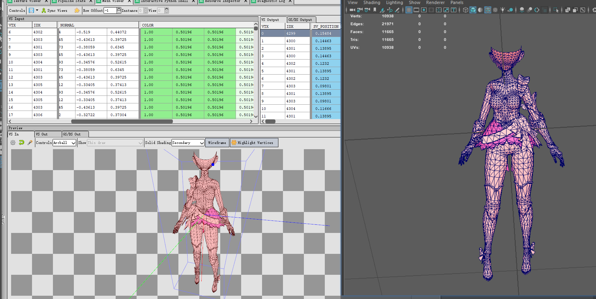
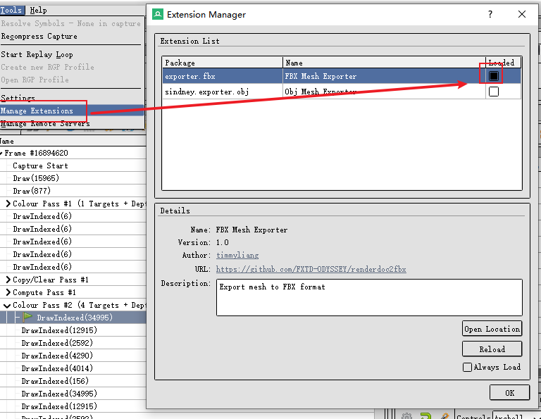
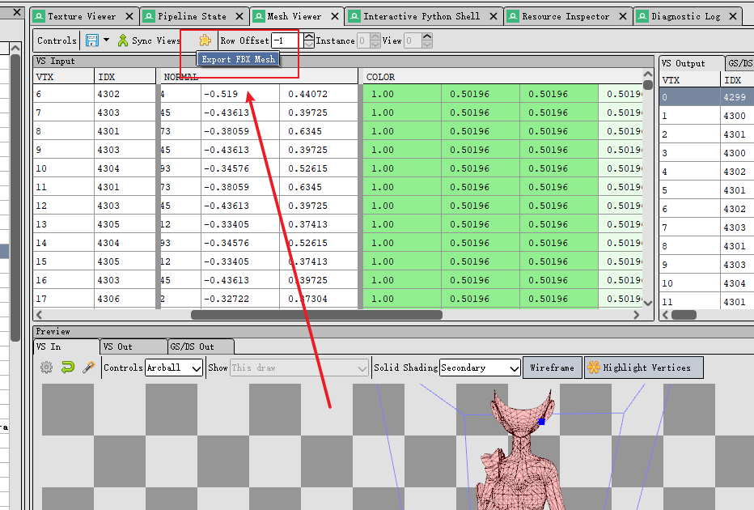

# renderdoc2fbx
renderdoc python extension for exporting fbx data

## Fork 说明

本仓库是基于上游项目 [`chineseoldghost/csv2fbx`](https://github.com/chineseoldghost/csv2fbx) 整理和修改的 fork 版本，并非原创项目。

这个 fork 主要针对当前 RenderDoc 版本以及 Unreal Engine 导入流程中暴露出来的兼容性问题进行了修复。

## Installation

copy `fbx_exporter` folder to `%appdata%\qrenderdoc\extensions`

If you are in the windows platform, you can use `install.bat` to install the extension.

## Feature

Export ASCII FBX File Support

+ **Vertex** 
+ **Normal** 
+ **UV**
+ **Tangent**
+ **VertexColor**

## Usage

make sure you copy the extension to the `%appdata%\qrenderdoc\extensions` directory

launch `renderdoc` and open the `Extension Manager`

then go to the Mesh Viewer click the extension icon menu to export the current data as the FBX file.

## Notice 

~~Export Large Mesh especially more than 30000 vertices need several seconds~~  
~~Python extension not efficient enough for that large Mesh. ~~

I change the export method which greatly enhance the export performance. 

## 本版本变更

- 兼容较新的 RenderDoc 版本，在网格输入表格对象名由 `vsinData` 变为 `inTable` 时仍可正常导出。
- 同时保留对旧版 RenderDoc 的支持，导出前会同时尝试 `vsinData` 和 `inTable`。
- 当网格表格未找到时，弹出明确错误提示，而不是直接抛出异常。
- 针对 Unreal 导出做坐标系转换，避免导入后还需要手动修正轴向。
- 修正 Unreal 导出中的镜像方向问题，按正确的手系关系导出模型。
- 保持 polygon corner 数据与导出几何一致，避免 Unreal 导入后出现 UV 扭曲或翻面问题。

## 问题与兼容性说明

### 1. RenderDoc 新版本界面对象名不兼容

最初插件在导出时会直接查找名为 `vsinData` 的表格控件，但在当前 RenderDoc 版本中，实际使用的控件名已经变成了 `inTable`。  
这会导致插件取不到表格模型，随后在调用 `table.model()` 时直接报错。

最终处理方式：

- 同时兼容 `vsinData` 和 `inTable`
- 如果两个对象名都找不到，就弹出明确错误，而不是抛异常

### 2. Unreal 导入后模型方向不对

导入 Unreal 后，模型一开始是竖着的，需要手动把 `X = -90` 才能看起来接近正常。  
原因不是 FBX 文件损坏，而是原始导出逻辑基本直接使用了 RenderDoc 捕获到的坐标，没有对 Unreal 的坐标系做专门转换。

最终处理方式：

- Unreal 预设下对导出向量使用 `[-x, z, -y]`
- 这相当于把原来需要手动做的轴向修正直接烘进导出结果

### 3. Unreal 导入后出现镜像

模型在转正之后，左右方向仍然像镜像，表现为 `+X` / `-X` 方向反了。  
这说明问题不只是简单的旋转，还包含手系差异。

最终处理方式：

- 在 Unreal 导出路径中加入手系修正
- 与坐标轴转换一起处理，避免导入后再手动镜像

### 4. 面朝向反了

一开始看起来像是三角形 winding 顺序错误，所以曾尝试过反转三角形角点顺序。  
但后续验证发现，Unreal 的坐标转换本身已经包含了反射，手系会一起变化；如果此时再额外反转 triangle winding，就会把面朝向再次翻反。

最终处理方式：

- 保留 Unreal 空间坐标转换
- 不再额外反转 triangle winding
- 让面朝向和坐标变换保持一致

### 5. UV 扰乱 / 三角形内部扭曲

这个问题表面上像 UV 值错乱，但实际根因是“几何角点顺序”和“逐角点属性顺序”不一致。  
在 FBX 里，UV、normal、tangent、color 这些数据都和 polygon corner 顺序强相关。如果只改了几何三角形顺序，却没有同步处理这些按角点绑定的数据，就会出现：

- 面片整体看起来位置差不多正确
- 但三角形内部插值明显扭曲
- 或者局部面片贴图方向异常

最终处理方式：

- 保持 polygon corner 数据与导出的几何顺序一致
- normal、tangent、UVIndex、color index 等都按同一套逻辑输出

## 最终保留的修复

当前 fork 中真正保留下来的兼容性修复主要包括：

- 兼容 `vsinData` / `inTable`
- Unreal 导出坐标转换为 `[-x, z, -y]`
- 不再额外反转 triangle winding
- normal / tangent 与 Unreal 坐标一起变换
- UV / color / normal / tangent 与 polygon corner 顺序保持一致

这些修改的目标不是改变原始功能，而是补足原始插件在新版 RenderDoc 和 Unreal 导入链路中的兼容性缺口。
